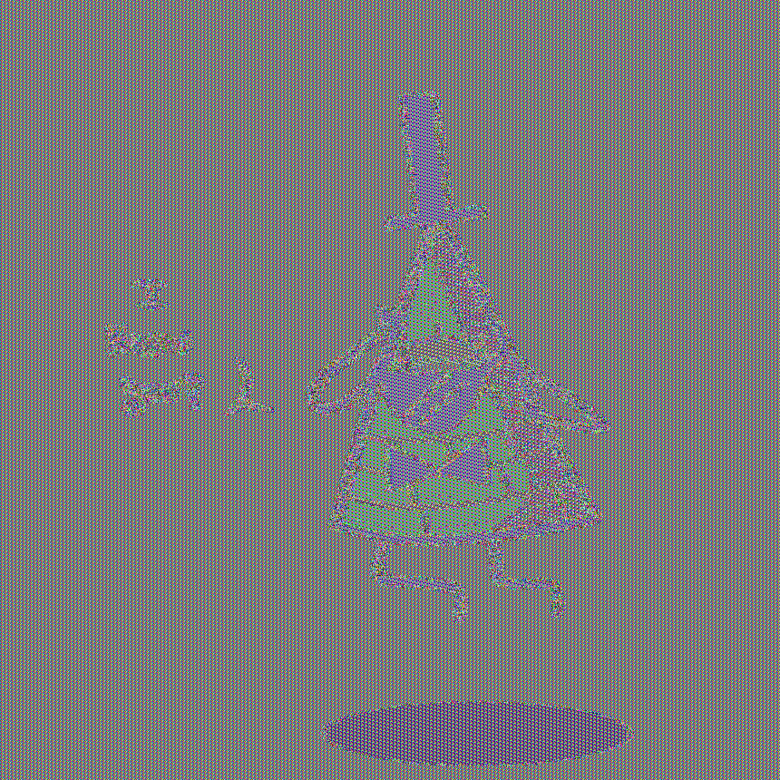

# 2.1 Análisis de Tamaños de Clave

##  Tamaños de clave utilizados

### DES

* Tamaño nominal: **64 bits**
* Tamaño efectivo: **56 bits**
* En bytes: **8 bytes**

DES utiliza 64 bits totales, pero 8 bits son de paridad, por lo que la seguridad real es de 56 bits.

---

### 3DES

Se utilizaron dos variantes:

#### 2-Key 3DES

* Tamaño: **128 bits**
* En bytes: **16 bytes**
* Esquema: K1, K2, K1
* Seguridad efectiva: ≈112 bits

#### 3-Key 3DES

* Tamaño: **192 bits**
* En bytes: **24 bytes**
* Esquema: K1, K2, K3
* Seguridad efectiva: ≈168 bits

---

### AES

* Tamaño utilizado: **256 bits**
* En bytes: **32 bytes**
* Seguridad efectiva: 256 bits

---

#  Snippet de generación de claves

```python
from Generacion_Llaves import key_des, key_3des, key_aes

k_des = key_des()
k_3des_128 = key_3des(128)
k_3des_192 = key_3des(192)
k_aes = key_aes(256)

print("DES:", len(k_des), "bytes")
print("3DES 128:", len(k_3des_128), "bytes")
print("3DES 192:", len(k_3des_192), "bytes")
print("AES 256:", len(k_aes), "bytes")
```

Salida esperada:

```
DES: 8 bytes
3DES 128: 16 bytes
3DES 192: 24 bytes
AES 256: 32 bytes
```

---

#  ¿Por qué DES es inseguro hoy en día?

DES es inseguro debido a su clave efectiva de **56 bits**.

Espacio total de claves:

[
2^{56} = 72,057,594,037,927,936 \approx 7.2 \times 10^{16}
]

Con hardware moderno (ej. GPU o FPGA especializado), se pueden probar aproximadamente:

* 10¹¹ claves por segundo (100 mil millones/s)

Tiempo estimado de ataque:

[
\frac{7.2 \times 10^{16}}{10^{11}} = 720,000 \text{ segundos}
]

Convertido a horas:

[
\frac{720,000}{3600} \approx 200 \text{ horas}
]

≈ **8 días**

Con hardware distribuido o ASIC especializado (como el EFF Deep Crack en 1998), DES puede romperse incluso en menos de 24 horas.

Por lo tanto, DES es vulnerable a ataques de fuerza bruta y ya no se considera seguro.

---

#  Estimación Fuerza Bruta Comparativa

### 3DES (112 bits efectivos)

[
2^{112} \approx 5.19 \times 10^{33}
]

A 10¹¹ claves/seg:

[
5.19 \times 10^{22} \text{ segundos}
]

Eso equivale a aproximadamente:

[
1.6 \times 10^{15} \text{ años}
]

Prácticamente inviable.

---

### AES-256

[
2^{256} \approx 1.15 \times 10^{77}
]

Incluso con 10¹⁵ intentos por segundo:

[
1.15 \times 10^{62} \text{ segundos}
]

Tiempo astronómico, mucho mayor que la edad del universo (~10¹⁷ segundos).

AES-256 es computacionalmente seguro contra fuerza bruta.

---

A continuación tienes el contenido listo para tu `README.md`, estructurado y fundamentado técnicamente.

---

# 2.2 Comparación de Modos de Operación: ECB vs CBC

##  Modos implementados en cada algoritmo

* **DES (Ejercicio 1.1)** → Modo **ECB**
* **3DES (Ejercicio 1.2)** → Modo **CBC**
* **AES (Ejercicio 1.3)** → Modos **ECB y CBC** (para análisis visual)

Para el análisis comparativo visual se utilizó **AES-256**, cifrando únicamente los datos de píxeles de la imagen.

---

# Diferencias fundamentales entre ECB y CBC


##  ECB (Electronic Codebook)




* No utiliza IV.
* Cada bloque se cifra de manera independiente.
* Si dos bloques de entrada son idénticos → producen bloques cifrados idénticos.
* Es determinístico.
* Permite análisis de patrones.

Formalmente:

[
C_i = E_K(P_i)
]

---

##  CBC (Cipher Block Chaining)


* Utiliza un IV aleatorio.
* Cada bloque depende del bloque cifrado anterior.
* El mismo bloque de entrada produce diferentes salidas si cambia el IV.
* Rompe patrones visibles.

Formalmente:

[
C_i = E_K(P_i \oplus C_{i-1})
]

con:

[
C_0 = IV
]

---


Sí, la diferencia es claramente visible.

### Imagen Original

Contiene patrones repetitivos (zonas de color uniforme, bordes definidos).

### Imagen cifrada con ECB

* Se conservan estructuras generales.
* Se distinguen siluetas y contornos.
* Los bloques repetidos generan patrones repetidos.
* Se puede reconocer la forma general del objeto.

### Imagen cifrada con CBC

* Apariencia completamente aleatoria.
* No se distinguen contornos.
* No hay patrones repetidos visibles.
* Parece ruido uniforme.

---


En ECB:

* Zonas de color uniforme generan bloques idénticos.
* Líneas horizontales o verticales mantienen estructura.
* Bordes siguen siendo perceptibles.

En CBC:

* Cada bloque depende del anterior.
* Incluso píxeles idénticos generan resultados distintos.
* Se elimina completamente la correlación visual.

---


```python
from Crypto.Cipher import AES
from Crypto.Util.Padding import pad
from Crypto.Random import get_random_bytes

from Generacion_Llaves import key_aes

from PIL import Image
import numpy as np


INPUT_IMAGE = "pic.png"
BLOCK_SIZE = 16


def encrypt_pixels(mode: str):

    KEY = key_aes(256)

    img = Image.open(INPUT_IMAGE)
    img = img.convert("RGB")

    pixel_array = np.array(img)
    pixel_bytes = pixel_array.tobytes()

    padded = pad(pixel_bytes, BLOCK_SIZE)

    if mode == "ECB":
        cipher = AES.new(KEY, AES.MODE_ECB)
        encrypted = cipher.encrypt(padded)

    elif mode == "CBC":
        iv = get_random_bytes(16)
        cipher = AES.new(KEY, AES.MODE_CBC, iv)
        encrypted = cipher.encrypt(padded)

    encrypted = encrypted[:len(pixel_bytes)]

    encrypted_array = np.frombuffer(encrypted, dtype=np.uint8)
    encrypted_array = encrypted_array.reshape(pixel_array.shape)

    encrypted_img = Image.fromarray(encrypted_array)
    encrypted_img.save(f"pic_{mode}.png")

```

---


